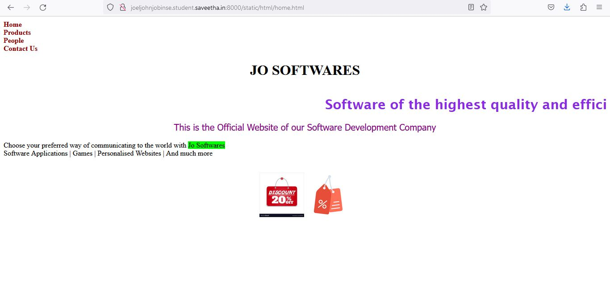
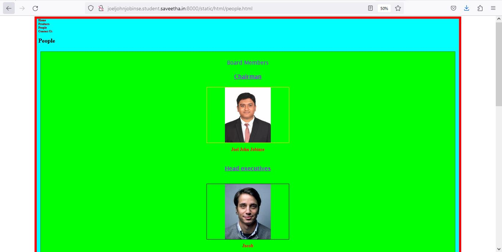
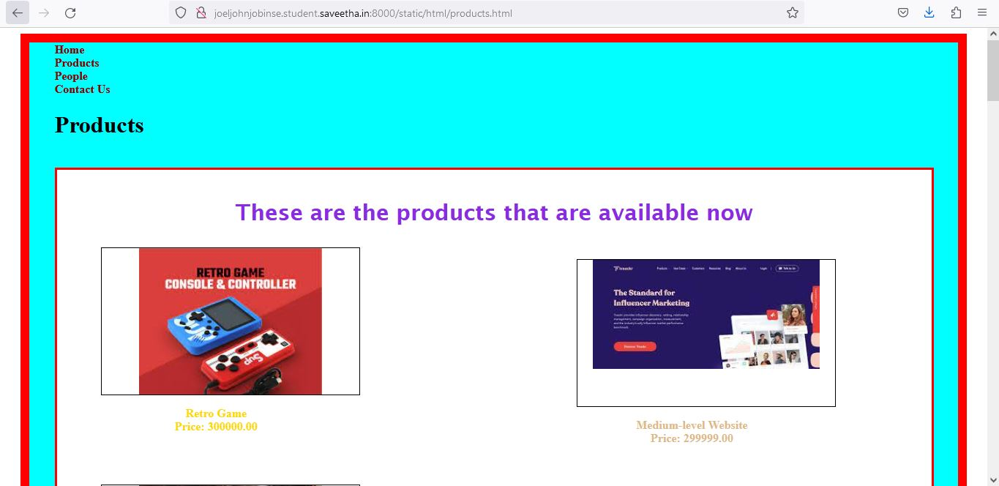
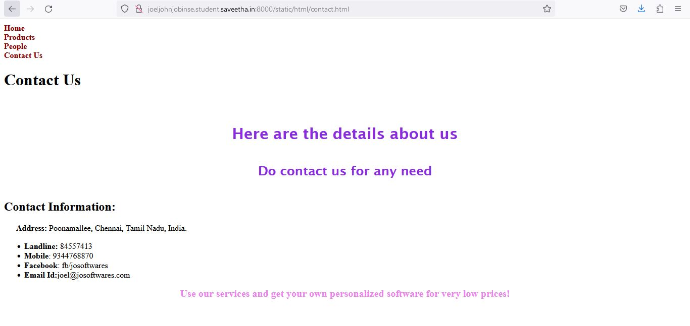

# Web Design for a Software Product Company

## AIM:

To design a static website for a software product company company.

## DESIGN STEPS:

### Step 1:

Requirement collection.

### Step 2:

Creating the layout using HTML and CSS.

### Step 3:

Updating the sample content.

### Step 4:

Choose the appropriate style and color scheme.

### Step 5:

Validate the layout in various browsers.

### Step 6:

Validate the HTML code.

### Step 6:

Publish the website in the given URL.

## PROGRAM :

### home.html:
```html
<!DOCTYPE html>
<html lang="en">
    <head>
        <title>
            Home Page
        </title>
        <meta name="viewport" 
         content="width=device-width, initial-scale=1.0">
        <link rel="stylesheet" href="/static/CSS/style.css">
    <style>
    .text{
        color:blueviolet;
        font-family:'Lucida Sans';
        font-size: 30px;
        text-align:center;
    }
    img{
        height: 100px;
        width: 100px;
        align-items:center;
    }
    </style>

    </head>
    <body>
        <div class="home">
            <div class="header">
                <header>
                    <div class=logo></div>
                    <div class=h>
                    <a href="home.html" title="Home" style="color: darkred; text-decoration: none;"><b>Home</b></a></div>
                    <div class="prod">
                        <a href="products.html" title="Products" style="color: darkred; text-decoration: none;"><b>Products</b></a>
                    </div>
                    <div class="people">
                        <a href="people.html" title="People" style="color:darkred; text-decoration: none;"><b>People</b></a>
                    </div>
                    <div class="contact">
                        <a href="contact.html" title="Contact Us" style="color:darkred; text-decoration: none;"><b>Contact Us</b></a>
                    </div>
                </header>
                <div class="title">
                    <center><h1>JO SOFTWARES</h1></center>
                </div><br>
                <div class="content">
                    <div class="text">
                    <marquee><b>Software of the highest quality and efficiency!</b></marquee>
                    <p style="color:purple; font-family:'Tahoma'; font-size:20px;"> This is the Official Website of our Software Development Company</p>
                    </div>
                    <p>Choose your preferred way of communicating to the world with <span style="background-color:lime">
                        Jo Softwares</span>
                        <br>Software Applications | Games | Personalised Websites | And much more</p>
                    <br>
                <center>
                    
                    
                </center>
                </div>
                <div class="footer">
                <footer style="color:white">
                Copyright &copy;2023 Developed by Joel John Jobinse</footer></div>
            </div>
        </div>
    </body>
</html>
```

### people.html:
```html
<!DOCTYPE html>
<html lang="en">
    <head>
        <title>
            Our Diligent Workers
        </title>
        <meta name="viewport" content="width=device-width, initial-scale=1.0">
        <link rel="stylesheet" href="/static/CSS/style.css">
        <style>
        .home{
            height: 3300px;
            width: 85%;
            border: 12px solid red;
            padding-left:10px;
            padding-right:10px;
            margin-left: auto;
            margin-right:auto;
            background-color:cyan;
        }
        .text{
        color:blueviolet;
        font-family:'Lucida Sans';
        font-size: 30px;
        text-align:center;
        
        }
        .content{
            border:2px solid green;
            background-color:lime;
            width:98%;
            height:2890px;
            padding:10px;
            margin-left:auto;
            margin-right:auto;
        }
        .ceoph{
            background-image: url(/static/images/me.jpeg);
            background-size: 250px;
            background-position-x: center;
            background-repeat: no-repeat;
            border:3px solid gold;
            height:300px;
            width:20%;
            position:relative;
            left: 0px;
            margin-left:auto;
            margin-right: auto;
        }
        .ceo{
            color: red;
            position:relative;
            text-align:center;
            
            
        }
        .manph1{
            background-image: url(/static/images/ppl1.jpg);
            background-size: 250px;
            background-position-x: center;
            background-repeat: no-repeat;
            border:1px solid black;
            height:300px;
            width:20%;
            position:relative;
            margin-left:auto;
            margin-right:auto;            
        }
        .man1{
            color: red;
            position:relative;
            text-align:center;
            
        }
        .manph2{
            background-image: url(/static/images/ppl2.jpg);
            background-size: 250px;
            background-position-x: center;
            background-repeat: no-repeat;
            border:1px solid black;
            height:300px;
            width:20%;
            position:relative;
            margin-left:auto;
            margin-right:auto;

            
        }
        .man2{
            color: red;
            position:relative;
            text-align:center;
        }
        
        .amph1{
            background-image: url(/static/images/ppl3.jpg);
            background-size: 250px;
            background-position-x: center;
            background-repeat: no-repeat;
            border:1px solid black;
            height:300px;
            width:20%;
            position:relative;
            margin-left:auto;
            margin-right:auto;

            
        }
        .am1{
            color: red;
            position:relative;
            text-align:center;
        }

        .amph2{
            background-image: url(/static/images/ppl4.jpg);
            background-size: 250px;
            background-position-x: center;
            background-repeat: no-repeat;
            border:1px solid black;
            height:220px;
            width:20%;
            position:relative;
            margin-left:auto;
            margin-right:auto;

            
        }
        .am2{
            color: red;
            position:relative;
            text-align:center;
        }
        .amph3{
            background-image: url(/static/images/ppl5.jpg);
            background-size: 250px;
            background-position-x: center;
            background-repeat: no-repeat;
            border:1px solid black;
            height:250px;
            width:20%;
            position:relative;
            margin-left:auto;
            margin-right:auto;

            
        }
        .am3{
            color: red;
            position:relative;
            text-align:center;
        }
        .amph4{
            background-image: url(/static/images/ppl6.jpg);
            background-size: 250px;
            background-position-x: center;
            background-repeat: no-repeat;
            border:1px solid black;
            height:250px;
            width:20%;
            position:relative;
            margin-left:auto;
            margin-right:auto;

            
        }
        .am4{
            color: red;
            position:relative;
            text-align:center;
        }
        </style>
    </head>
    <body>
        <div class="home">
            <div class="header">
                <header>
                    <div class=logo></div>
                    <div class=h>
                    <a href="home.html" title="Home" style="color: darkred; text-decoration: none;"><b>Home</b></a></div>
                    <div class="prod">
                        <a href="products.html" title="Products" style="color: darkred; text-decoration: none;"><b>Products</b></a>
                    </div>
                    <div class="people">
                        <a href="people.html" title="People" style="color:darkred; text-decoration: none;"><b>People</b></a>
                    </div>
                    <div class="contact">
                        <a href="contact.html" title="Contact Us" style="color:darkred; text-decoration: none;"><b>Contact Us</b></a>
                    </div>
                </header>
                <div class="title">
                    <h1>People</h1>
                </div><br>
                <div class="content">
                    <div class="text">
                    <p>Board Members</p>
                    <h4><u>Chairman</u></h4>
                    </div>
                    <div class="ceoph"></div>
                    <div class="ceo"><p align="center"><b><h2>Joel John Jobinse</h2></b></div>
                    <br>
                    <div class="text">
                        <p><b><u>Head executives</u></b></p><br>
                    </div>
                    <div class="manph1"></div>
                    <div class="man1"><p align="center"><b><h2>Jacob</h2></b></p></div>
                    <div class="manph2"></div>
                    <div class="man2"><p><b><h2>Simon</h2></b></p></div>
                    <br>
                    <div class="text"><p><b><u>Managers</u></b></p></div><br>
                    <div class="amph1"></div>
                    <div class="am1"><p align="center"><b><h2>Frederick</h2></b></p></div>
                    <div class="amph2"></div>
                    <div class="am2"><p align="center"><b><h2>Greg</h2></b></p></div>
                    <div class="amph3"></div>
                    <div class="am3"><p align="center"><b><h2>Cillian</h2></b></p></div><br>
                    <div class="amph4"></div>
                    <div class="am4"><p align="center"><b><h2>Sarah</h2></b></p></div><br>
                    <div class="text">Thank you so much for your kind support!<br>Hope our products had made you more Happy!</div>
                </div>
                <div class="footer">
                <footer style="color:white">
                Copyright &copy;2023 Developed by Joel John Jobinse</footer></div>
            </div>
        </div>
    </body>
</html>
```

### products.html:
```html
<!DOCTYPE html>
<html lang="en">
    <head>
        <title>
            Products
        </title>
        <meta name="viewport" content="width=device-width, initial-scale=1.0">
        <link rel="stylesheet" href="/static/CSS/style.css">
        <style>
        .home{
            height: 2400px;
            width: 90%;
            border: 12px solid red;
            padding-left:35px;
            padding-right:35px;
            margin-left: auto;
            margin-right:auto;
            background-color:cyan;
        }
        .text{
            color:blueviolet;
            font-family:'Lucida Sans';
            font-size: 30px;
            text-align:center;
        
        }
        .content{
            border:3px solid red;
            background-color: white;
            width:98%;
            height:1990px;
            padding:10px;
            margin-left:auto;
            margin-right:auto;
        }
        .ph1{
            background-image: url(/static/images/ph1.jpg);
            background-size: 250px;
            background-position-x: center;
            background-repeat: no-repeat;
            border:1px solid black;
            height:200px;
            width:30%;
            position:relative;
            left: 50px;
        }
        .l1{
            color: gold;
            position:relative;
            right:380px;
            
            
        }
        .ph2{
            background-image: url(/static/images/ph2.jpg);
            background-size: 250px;
            background-position-x: center;
            background-repeat: no-repeat;
            border:1px solid black;
            height:200px;
            width:30%;
            position:relative;
            left: 50px;
            
        }
        .l2{
            color: sandybrown;
            position:relative;
            right:380px;
        }
        .ph3{
            background-image: url(/static/images/ph3.jpg);
            background-size: 250px;
            background-position-x: center;
            background-repeat: no-repeat;
            border:1px solid black;
            height:210px;
            width:30%;
            position:relative;
            left: 50px;
            
        }
        .l3{
            color: burlywood;
            position:relative;
            right:380px;
        }
        .ph4{
            background-image: url(/static/images/ph4.jpg);
            background-position-x: center;
            border:1px solid black;
            height:200px;
            width:30%;
            position:relative;
            left: 700px;
            bottom:930px;
            background-size: 310px;
            background-repeat: no-repeat;
            
            
        }
        .l4{
            color: burlywood;
            position:relative;
            left:270px;
            bottom: 930px;
        }
    
        .ph5{
            background-image: url(/static/images/ph5.jpg);
            background-position-x: center;
            border:1px solid black;
            height:210px;
            width:30%;
            position:relative;
            left: 700px;
            bottom:930px;
            background-size: 280px;
            background-repeat: no-repeat;
            
            
        }
        .l5{
            color: cadetblue;
            position:relative;
            left:270px;
            bottom: 930px;
        }

        .ph6{
            background-image: url(/static/images/ph6.jpg);
            background-position-x: center;
            border:1px solid black;
            height:200px;
            width:30%;
            position:relative;
            left: 700px;
            bottom:930px;
            background-size: 280px;
            background-repeat: no-repeat;
            
            
        }
        .l6{
            color: crimson  ;
            position:relative;
            left:270px;
            bottom: 930px;
        }
        .ph7{
            background-image: url(/static/images/ph7.jpg);
            background-position-x: center;
            border:1px solid black;
            height:200px;
            width:30%;
            position:relative;
            left: 700px;
            bottom:930px;
            background-size: 280px;
            background-repeat: no-repeat;
            
        }
        .l7{
            color: blanchedalmond;
            position:relative;
            left:270px;
            bottom: 930px;
        }
        .ph8{
            background-image: url(/static/images/ph8.jpg);
            background-position-x: center;
            border:1px solid black;
            height:200px;
            width:30%;
            position:relative;
            left: 700px;
            bottom:930px;
            background-size: 280px;
            background-repeat: no-repeat;
            
            
        }
        .l8{
            color: chocolate;
            position:relative;
            left:270px;
            bottom: 930px;
        }
        .ph9{
            background-image: url(/static/images/ph9.jpg);
            background-position-x: center;
            border:1px solid black;
            height:200px;
            width:30%;
            position:relative;
            left: 700px;
            bottom:930px;
            background-size: 280px;
            background-repeat: no-repeat;
            
            
        }
        .l9{
            color: aquamarine;
            position:relative;
            left:270px;
            bottom: 930px;
        }
        .ph10{
            background-image: url(/static/images/ph10.jpg);
            background-position-x: center;
            border:1px solid black;
            height:200px;
            width:30%;
            position:relative;
            right: -70px;
            bottom:1260px;
            background-size: 280px;
            background-repeat: no-repeat;
            
            
        }
        .l10{
            color: darkorchid;
            position:relative;
            right:370px;
            bottom: 1270px;
        }
        .ph11{
            background-image: url(/static/images/ph11.jpg);
            background-position-x: center;
            border:1px solid black;
            height:200px;
            width:30%;
            position:relative;
            right: -70px;
            bottom:1920px;
            background-size: 280px;
            background-repeat: no-repeat;
            
            
        }
        .l11{
            color: forestgreen;
            position:relative;
            right:370px;
            bottom: 1910px;
        }
        .ph12{
            background-image: url(/static/images/ph12.jpg);
            background-position-x: center;
            border:1px solid black;
            height:200px;
            width:30%;
            position:relative;
            right: -70px;
            bottom:2550px;
            background-size: 280px;
            background-repeat: no-repeat;
            
            
        }
        .l12{
            color: grey;
            position:relative;
            right:370px;
            bottom: 2560px;
        }
        .bot{
            text-align:center;
            font-size:larger;
            color:magenta;

        }
        </style>
    </head>
    <body>
        <div class="home">
            <div class="header">
                <header>
                    <div class=logo></div>
                    <div class=h>
                    <a href="home.html" title="Home" style="color: darkred; text-decoration: none;"><b>Home</a></div>
                    <div class="prod">
                        <a href="products.html" title="Products" style="color: darkred; text-decoration: none;"><b>Products</b></a>
                    </div>
                    <div class="people">
                        <a href="people.html" title="People" style="color:darkred; text-decoration: none;"><b>People</b></a>
                    </div>
                    <div class="contact">
                        <a href="contact.html" title="Contact Us" style="color:darkred; text-decoration: none;"><b>Contact Us</b></a>
                    </div>
                </header>
                <div class="title">
                    <h1>Products</h1>
                </div><br>
                <div class="content">
                    <div class="text">
                    <p>These are the products that are available now</p>
                    </div>
                    <div class="ph1"></div>
                    <div class="l1"><p align="center"><b>Retro Game<br> Price: 300000.00</b><br><br><br><br></p></div>
                    <div class="ph2"></div>
                    <div class="l2"><p align="center"><b>Advanced Game<br> Price: 600000.00</b><br><br><br><br></p></div>
                    <div class="ph3"></div>
                    <div class="l3"><p align="center"><b>Small-level Website<br> Price: 199900.00</b><br<br><br><br></p></div>
                    <div class="ph4"></div>
                    <div class="l4"><p align="center"><b>Medium-level Website<br> Price: 299999.00</b><br><br><br><br></p></div>
                    <div class="ph5"></div>
                    <div class="l5"><p align="center"><b>Large-Level website<br> Price: 499999.00</b><br><br><br><br></p></div>
                    <div class="ph6"></div>
                    <div class="l6"><p align="center"><b>Database System<br> Price: 229999.00</b><br><br><br><br></p></div>
                    <div class="ph7"></div>
                    <div class="l7"><p align="center"><b>Small-level Software Application<br> Price: 199999.00</b><br><br><br><br></p></div>
                    <div class="ph8"></div>
                    <div class="l8"><p align="center"><b>Medium-level Software Application<br> Price: 799999.00</b><br><br><br><br></p></div>
                    <div class="ph9"></div>
                    <div class="l9"><p align="center"><b>Large-level Software Application<br> Price: 1099999.00</b><br><br><br><br></p></div>
                    <div class="ph10"></div>
                    <div class="l10"><p align="center"><b>Operating System<br> Price: 2299999.00</b><br><br><br><br></p></div>
                    <div class="ph11"></div>
                    <div class="l11"><p align="center"><b>Flight Management Software<br> Price: 1499999.00</b><br><br><br><br></p></div>
                    <div class="ph12"></div>
                    <div class="l12"><p align="center"><b>Digital Ecosystem<br> Price: 1899999.00</b><br><br><br><br></p></div>
                </div>
                <div class="bot"><p>To Order Online: Call: 9344768870</p></div>

                <div class="footer">
                <footer style="color:white">
                Copyright &copy;2023 Developed by Joel John Jobinse</footer></div>
            </div>
        </div>
    </body>
</html>
```

### contact.html:
```html
<!DOCTYPE html>
<html lang="en">
    <head>
        <title>
            Contact Us
        </title>
        <meta name="viewport" 
         content="width=device-width, initial-scale=1.0">
        <link rel="stylesheet" href="/static/CSS/style.css">
    <style>
    .text{
        color:blueviolet;
        font-family:'Lucida Sans';
        font-size: 30px;
        text-align:center;
    }
    
    </style>

    </head>
    <body>
        <div class="home">
            <div class="header">
                <header>
                    <div class=logo></div>
                    <div class=h>
                    <a href="home.html" title="Home" style="color: darkred; text-decoration: none;"><b>Home</b></a></div>
                    <div class="prod">
                        <a href="products.html" title="Products" style="color: darkred; text-decoration: none;"><b>Products</b></a>
                    </div>
                    <div class="people">
                        <a href="people.html" title="People" style="color:darkred; text-decoration: none;"><b>People</b></a>
                    </div>
                    <div class="contact">
                        <a href="contact.html" title="Contact Us" style="color:darkred; text-decoration: none;"><b>Contact Us</b></a>
                    </div>
                </header>
                <div class="title">
                    <h1>Contact Us</h1>
                </div><br>
                <div class="content">
                    <div class="text">
                    <p><b>Here are the details about us
                    <h5>Do contact us for any need</h5></b></p>
                    
                    </div>
                    <b><h2>Contact Information:</h2></b>
                    <p><b>&emsp;&ensp;Address:</b>
                        Poonamallee, Chennai, Tamil Nadu, India.
                    </p>
                    <ul>
                        <li><b>Landline:</b> 84557413 </li>
                        <li><b>Mobile</b>: 9344768870 </li>
                        <li><b>Facebook</b>: fb/josoftwares </li>
                        <li><b>Email Id:</b>joel@josoftwares.com</li>
                    </ul>
                    <div style="text-align: center;color:violet;font-size:20px;"><b>Use our services and get your own personalized software for very low prices!</b></div>

                </div>
                <div class="footer">
                <footer style="color:white">
                Copyright &copy;2023 Developed by Joel John Jobinse</footer></div>
            </div>
        </div>
    </body>
</html>
```
## OUTPUT:

### Home Page:



### people.html:



### products.html:



### contact.html:



## Result:

Thus a website is designed for the software product company and the HTML,CSS code are validated.
